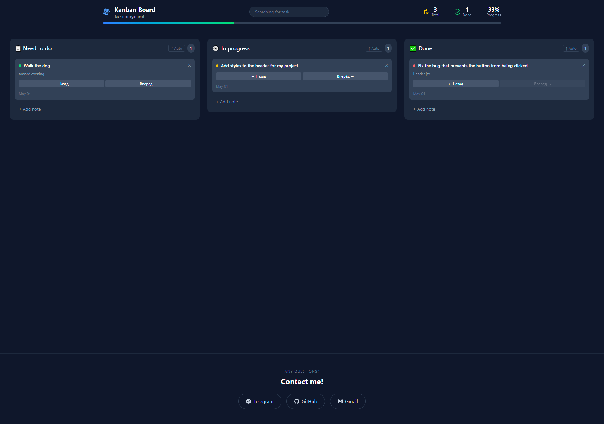

<div align="center">

# 📋 Kanban Board (TodoReactTS)

  <p>
    <a href="https://aliveagain3228.github.io/TodoReactTS/" target="_blank">
      
    </a>
  </p>

  <p>
    
    
    
    
  </p>

</div>

## 📝 About the Project
A modern and minimalistic Kanban board for managing daily tasks. This project was built to practice TypeScript typing skills and create flexible user interfaces using Tailwind CSS.

### 📸 App preview



## ✨ Features

- 🏗 Task Columns: Organized into "To Do", "In Progress", and "Done"
- 🏷 TypeScript Core: Full typing for props, state, and events
- 🎨 Modern UI: Responsive layout utilizing the Tailwind design system.
- ⚡ Vite Speed: Instant build and Hot Module Replacement (HMR).

## 🚀 Installation
```bash
# Clone the project
git clone [https://github.com/aliveagain3228/TodoReactTS.git](https://github.com/aliveagain3228/TodoReactTS.git)

# Install dependencies
npm install

# Run locally
npm run dev